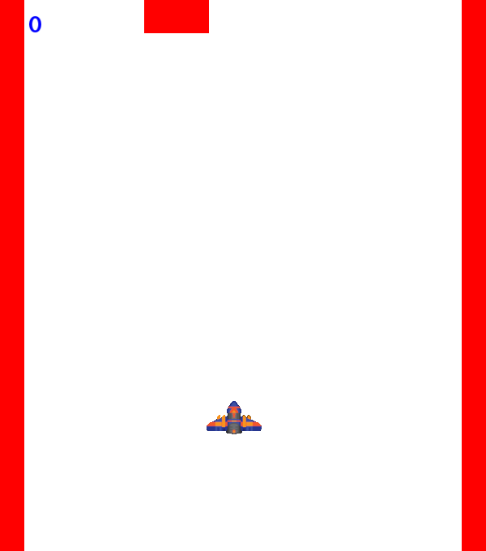
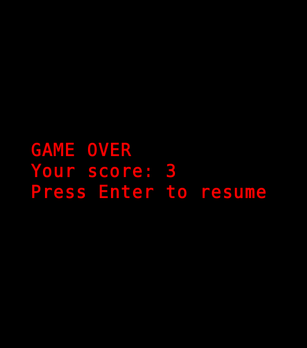
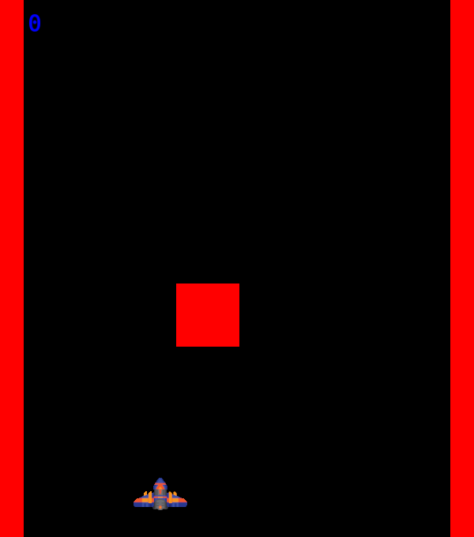

# Космические стрелялки

  
  
  
Вы - пилот данного космического корабля. Ваша цель - разрушать летящие в вашу сторону метеориты.  

## Запуск

Игра написана под Линукс  
Вам нужно установить sfml и запустить [start.sh](start.sh)

## Управление:

Стрелочка влево: переместить корабль влево  
Стрелочка вправо: переместить корабль вправо  
Вверх/Вниз я пока что делать не буду, но, возможно, сделаю.  
Пробел: выстрелить снаряд  
Enter: начать игру заново