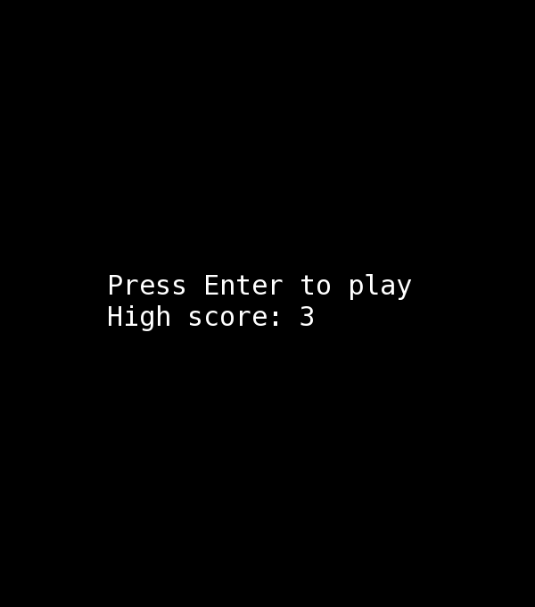

# Космические стрелялки

  
  
  
Суть игры заключается в том, что вы дожны убить как можно больше вражеских кораблей.
Здоровье каждого корабля равно 100 единицам. Ваше здоровье тоже равно 100 единицам, если что :)  

## Запуск

Игра написана под Линукс  
Вам нужно установить sfml и запустить [start.sh](start.sh)

## Управление:

Стрелочка влево: переместить корабль влево  
Стрелочка вправо: переместить корабль вправо  
Вверх/Вниз я пока что делать не буду, но, возможно, сделаю.  
Пробел: выстрелить снаряд  
Enter: начать игру заново